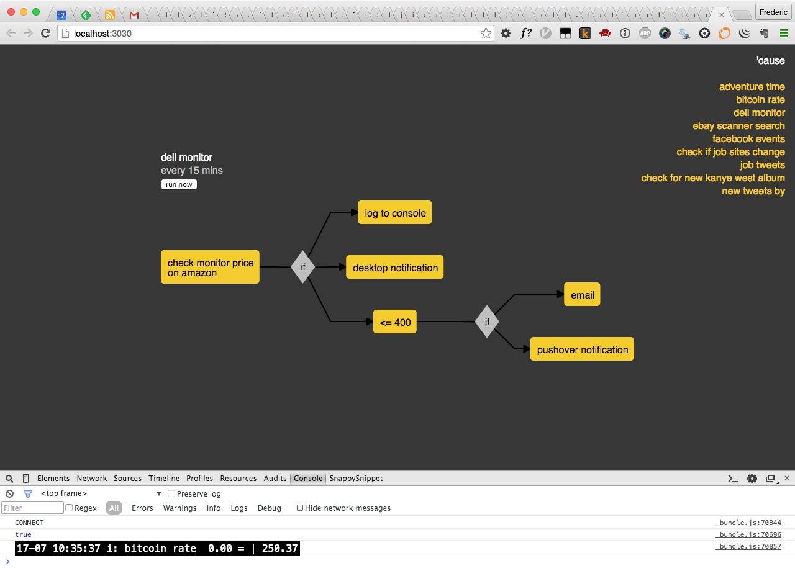

# ’cause

an automation tool


## why?

> ’cause


## no, seriously. other tools exist — why reinvent the wheel?

- [ifttt](https://ifttt.com/) is great, but too simple
- [yahoo! pipes](http://pipes.yahoo.com/pipes/) doesn't let you create your own modules
- [huginn](https://github.com/cantino/huginn) looks very promising, but I don't want to learn ruby
- [noflo](http://noflojs.org/) didn't seem very accessible at the time I looked at it
- I discovered [node-red](http://nodered.org/) only after I had already begun working on ’cause
- [workflow](https://workflow.is/) is nice, but ios only

ultimately I did it to scratch my own itch.
<!-- TODO: explain -->

theoretically you could use ’cause to do what tools like [maid](https://github.com/benjaminoakes/maid) and [controlplane](http://www.controlplaneapp.com/) do.


## installation

requirements:
- [node.js](http://nodejs.org/)
- [git](http://git-scm.com/)

```shell
git clone https://github.com/freder/cause.git
cd cause
npm install && bower install
gulp build
mv config.js.example config.js
```

then edit `config.js` and fill in the `XXXXXXXXX`s.


## run

```shell
node index.js
```

or, if you want to see [`debug`](https://www.npmjs.com/package/debug) messages:

```shell
DEBUG=cause:* node index.js
```


## web frontend

as you start the tool, it ~~opens the web frontend in the browser~~ will tell you the URL you can access the web frontend with.



it currently only lists your active tasks and a visualization. the plan for the future is to make it possible to create and edit tasks using the web interface.


## blocks

blocks are modular units — *building blocks,* so to speak. they receive the output of the previous block as their input, act upon it, and then in turn pass their output on to the next block. following the unix philosophy, blocks should only do one thing, but do it well.

based on its inherent logic, a ’cause block needs to decide if s.th. is worth reacting to or not. there are three different directions a block can pass its output on to:
- __if:__ s.th. changed / happened / fulfills a condition
- __else:__ the complement of __if__
- __always:__ always invoke the next block

you can think of it as an [`if` / `else`](https://developer.mozilla.org/en-US/docs/Web/JavaScript/Reference/Statements/if...else) statement with an extra `always` branch. each branch is optional and can have multiple following blocks connected to it.

<!-- TODO: a digram -->

### [a list of all available ’cause blocks on npm](https://www.npmjs.com/browse/keyword/cause-block)

### writing your own blocks

check out [cause-website-changed](https://github.com/freder/cause-website-changed/blob/master/cause-website-changed.js) for a documented example.

if you create your own building blocks, make sure to share them as an [npm package](https://www.npmjs.com/), and to add the `cause-block` tag / keyword.

<!-- TODO: create a yeoman generator for blocks -->

## tasks

<!-- TODO: explanation -->

tasks are defined as json files. example:

```json
{
	"name": "adventure time",
	"interval": "every 2 hours",
	"steps": [
		{
			"id": "feed",
			"block": "feed",
			"description": "check if there are new adventure time episodes",
			"options": {
				"url": "http://www.watchcartoononline.com/anime/adventure-time/feed"
			},
			"flow": {
				"if": [
					"console",
					"email"
				]
			}
		},
		{
			"id": "console",
			"block": "log-console",
			"options": {
				"title": "new episodes",
				"message": "<%var episodes = input.map(function(ep) { return ep.title; })%>\n<%=format.list(episodes)%>"
			}
		},
		{
			"id": "email",
			"block": "email-notification",
			"options": {
				"title": "new adventure time episode(s)",
				"message": "<%_.each(input, function(ep) {%><a href=\"<%=ep.link%>\"><%=ep.title%></a><br><%})%>"
			}
		}
	]
}
```

## cool examples / recipes

<!-- TODO: create a repository of example tasks. -->
